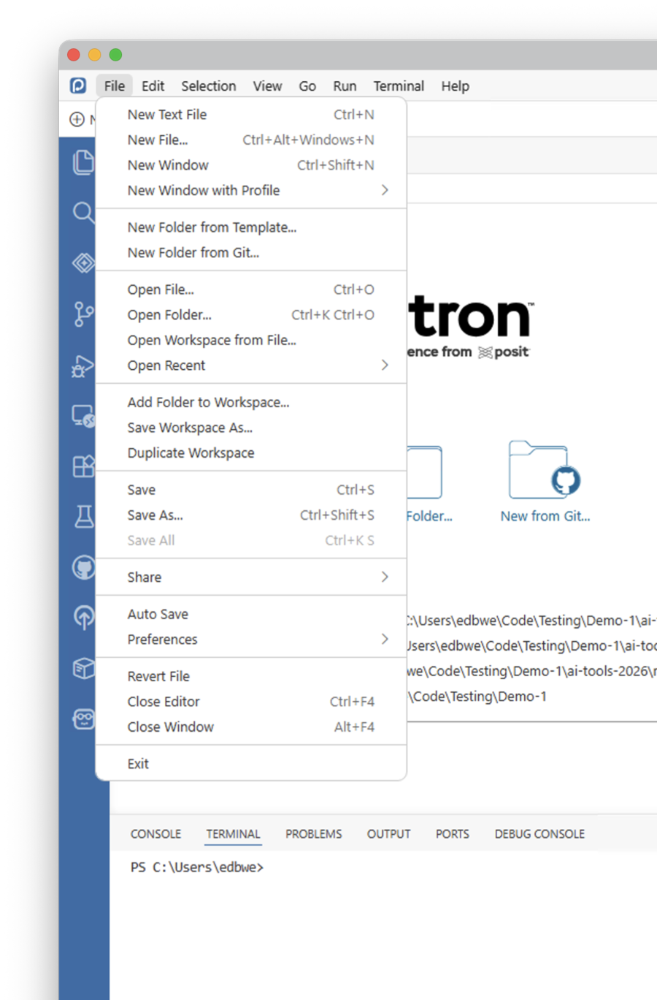
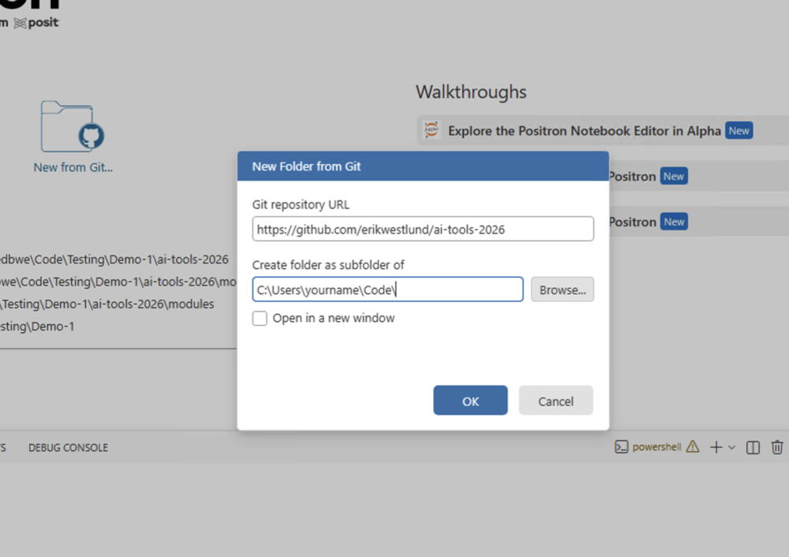
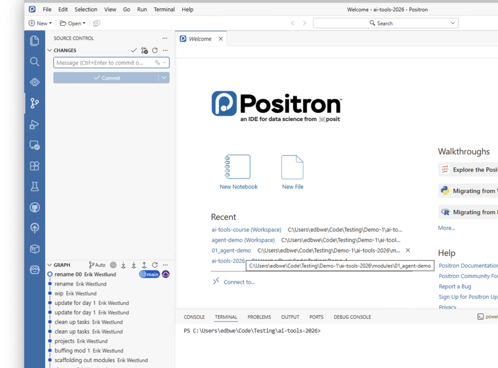

This walkthrough gets the course repository onto your computer using Positron or VS Code, then explains the project files that keep paths and rendering behavior predictable.

If you do not have either of these editors and want to go this route, pick Positron for data science/statistics workflows. VS Code is a good option for people who already use VS Code and do not need all of Positron's data science add-ons.

The screenshots show Positron, but the workflow is the same in VS Code.

# Step 1: Start From Positron Or VS Code

Open Positron or VS Code.

If you are on the welcome screen, you may see a **New from Git...** button. You can use that button directly.

You can also use the menu path shown below: **File** > **New Folder from Git...**.

{fig-alt="File menu showing the New Folder from Git option."}

# Step 2: Enter The Git Repository URL

In **Git repository URL**, enter:

```text
https://github.com/erikwestlund/ai-tools-2026
```

Choose the local folder where you want the course repository to be saved. Below I use a directory called `Code`, but you can put it wherever you typically put your projects.

Leave **Open in a new window** unchecked if you want the editor to open the repository in the current window. Typically you would leave this unchecked.

Click **OK**.

{fig-alt="New Folder from Git dialog showing the repository URL field and local folder field."}

# Step 3: Confirm The Repository Opened

After cloning finishes, Positron or VS Code should show the course folder as the current workspace.

Confirm that the folder name is `ai-tools-2026` and that you can see course files such as:

- `README.md`
- `updater.R`
- `index.html`
- `modules/`
- `practice/`
- `slides/`
- `assignments/`

If you click the three dots icon on the left, the lower-left panel shows the course Git history, including recent course updates and the current branch.

{fig-alt="Editor open after cloning the course repository, with the Git history area and terminal visible."}

# Step 4: Test The Updater

In the R Console, run:

```r
source("updater.R")
```

Alternatively, you can open `updater.R` and click the "Play" button (triangle) to run the code.

The updater should:

- pull the latest course materials from GitHub,
- copy missing practice task files into `practice/work/`,
- leave existing files in `practice/work/` alone.


# Step 5: Know Which Folder To Open For Agent Work

For hands-on work, first run the updater so the assigned task is copied into `practice/work/`. Then open the copied folder in `practice/work/`, not the course-owned folder in `modules/` or `practice/tasks/`.

For Day 2, open:

```text
practice/work/01_clean-and-visualize/
```

Use the workspace file inside that folder:

```text
clean-and-visualize.code-workspace
```

Do not open the whole course repository as the agent project unless the task explicitly asks for that.

# Step 6 (Optional): Open The Course Website

Open `index.html` from the file explorer (right click "View in Viewer").

This is the main course navigation page. It links to slides, modules, practice tasks, and assignments.


# How The Project Files Work

The course uses two kinds of files to orient Positron, VS Code, and Quarto.

## `.code-workspace`

A `.code-workspace` file tells Positron or VS Code which folder to open as the workspace.

If a module or practice task has its own `.code-workspace` file, open that file when working in Positron or VS Code. This keeps the file explorer and agent context focused on the assigned folder.

## `_quarto.yml`

Quarto uses `_quarto.yml` to decide where a Quarto project starts.

This matters because notebooks often read files with local paths such as:

```r
readr::read_csv("data/community_clinic_visits.csv")
```

Quarto walks up the folder tree until it finds the nearest `_quarto.yml`. If a module or practice task does not have its own `_quarto.yml`, Quarto may use the course repository root instead of the task folder.

That is why module and practice project folders include a local `_quarto.yml`: it makes paths like `data/...` resolve from the folder you opened.

**Note:** This is not the sole reason to use a `_quarto.yml` file. You can use these to apply settings to all Quarto notebook (`.qmd` files) in the current or nested directories.

# Quick Check

Before moving on, confirm:

- Positron or VS Code is open to `ai-tools-2026`.
- `source("updater.R")` runs.
- `practice/work/` exists.
- You know how to open a folder-level `.code-workspace` file for module or practice work.
