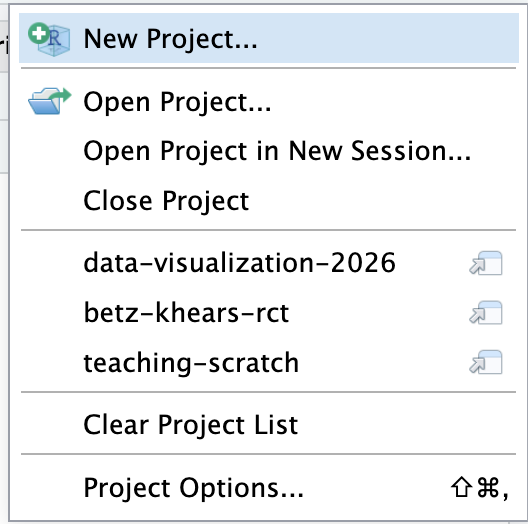
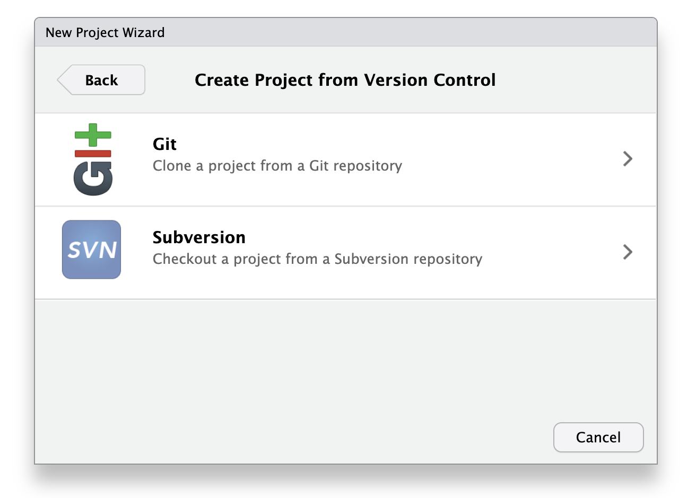
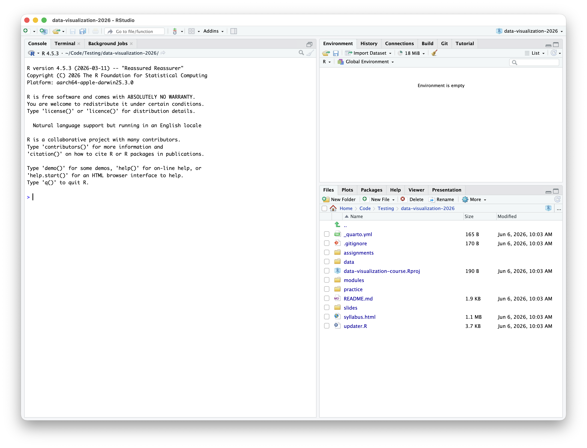

This walkthrough gets the course repository onto your computer using RStudio, then checks that updates work.

Use this if you are using RStudio for the course.

# Step 1: Open RStudio

Open RStudio.

You should see the usual RStudio panes: Console, Files, Environment, and Source/editor. The exact layout may vary.

# Step 2: Start A New Project

In the upper-right project menu, choose **New Project...**.

This opens the New Project wizard.

{fig-alt="RStudio project menu showing the New Project option."}

# Step 3: Choose Version Control

In the New Project wizard, choose **Version Control**.

This tells RStudio that you want to create a local project by cloning a Git repository.

{fig-alt="RStudio New Project wizard showing New Directory, Existing Directory, and Version Control options."}

# Step 4: Choose Git

Choose **Git**.

If Git is not listed, Git is not installed or RStudio cannot find it yet. Install Git first, then restart RStudio.

{fig-alt="RStudio Version Control screen showing Git and Subversion options."}

# Step 5: Enter The Repository URL

Paste this URL into **Repository URL**:

```text
https://github.com/erikwestlund/ai-tools-2026.git
```

RStudio should fill in the project directory name automatically:

```text
ai-tools-2026
```

Choose a local folder where you want the course folder to live. A coursework, projects, or documents folder is fine.

Click **Create Project**.

{fig-alt="RStudio Clone Git Repository dialog with fields for repository URL, project directory name, and local folder."}

The screenshot is an example from a similar course. Use the `ai-tools-2026` repository URL shown above for this course.

# Step 6: Confirm The Course Project Opened

After cloning finishes, RStudio should open the course project.

Check that the Files pane shows course files and folders such as:

- `README.md`
- `updater.R`
- `index.html`
- `modules/`
- `practice/`
- `slides/`
- `assignments/`

If you see these, the course repository is open.

{fig-alt="RStudio with a course project open and the standard four-pane layout visible."}

# Step 7 (Optional): Open The Course Website

Open `index.html` from the Files pane.

This is the main course navigation page. It links to slides, modules, practice tasks, and assignments.

# Step 8: Test The Updater

In the R Console, run:

```r
source("updater.R")
```

The updater should:

- pull the latest course materials from GitHub,
- copy missing practice task files into `practice/work/`,
- leave existing files in `practice/work/` alone.

One of these outcomes is normal:

- Git says the course is already up to date.
- Git downloads updates.
- The updater reports that new practice files were copied.
- The updater reports that existing practice files were left alone.

# Step 9: Know Where To Work

Course-owned folders may change when you update:

- `modules/`
- `slides/`
- `assignments/`
- `data/`
- `skills/`
- `practice/tasks/`

Save your own notebooks, scripts, rendered files, and notes in:

```text
practice/work/
```

# Step 10: Open A Practice Work Project For Hands-On Work

For hands-on work, first run the updater so the assigned task is copied into `practice/work/`. Then open the copied folder in `practice/work/`, not the course-owned folder in `modules/` or `practice/tasks/`.

For example, Day 2 starts with:

```text
practice/work/01_clean-and-visualize/
```

In that folder, open the `.Rproj` file in RStudio.

Opening the folder-level project keeps local paths such as `data/county_wellness_indicators_long.csv` working as expected.

# How The Project Files Work

The course uses two kinds of files to orient RStudio and Quarto.

## `.Rproj`

An `.Rproj` file tells RStudio where a project starts. For hands-on work, open the `.Rproj` file in the copied folder under `practice/work/`.

## `_quarto.yml`

Quarto uses `_quarto.yml` to decide where a Quarto project starts. It walks up the folder tree until it finds the nearest `_quarto.yml`.

This matters for paths such as:

```r
readr::read_csv("data/community_clinic_visits.csv")
```

Module and practice folders include local `_quarto.yml` files so paths like `data/...` resolve from the folder you opened, not from the parent course repository.

**Note:** This is not the only reason to use a `_quarto.yml` file. You can also use it to apply settings to all Quarto notebooks (`.qmd` files) in the current folder or nested folders.

# Troubleshooting

## Git Does Not Appear In RStudio

Install Git from <https://git-scm.com/downloads>, restart RStudio, and try again.

## The Repository URL Fails

Check that the URL is exactly:

```text
https://github.com/erikwestlund/ai-tools-2026.git
```

Also check that you have an internet connection.

## The Updater Fails

Do not delete the course folder.

Common causes:

- You edited course-owned files.
- Git is not installed or not visible to RStudio.
- The course folder was downloaded as a ZIP instead of cloned with Git.

Ask for help before forcing Git changes.

# Quick Check

Before moving on, confirm:

- The course folder is named `ai-tools-2026`.
- `index.html` opens.
- `source("updater.R")` runs.
- `practice/work/` exists.
- You know how to open a folder-level `.Rproj` from `practice/work/`.
